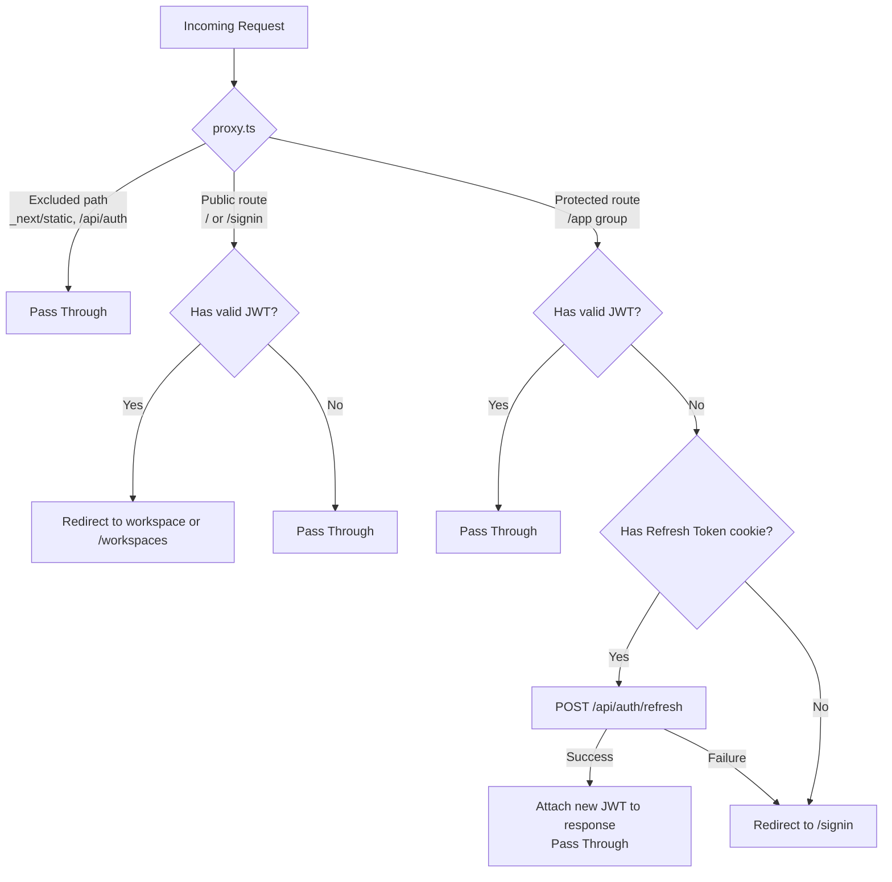
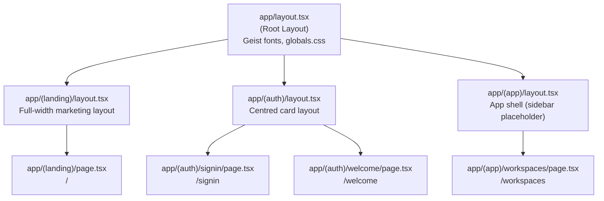
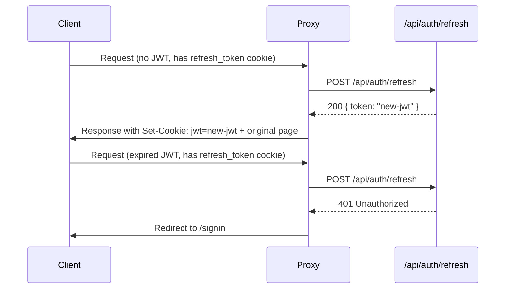

# Design Document: App Router Shell

## Overview

The App Router Shell establishes the foundational Next.js App Router structure for MiniSlack. It is the entry point for all navigation — authenticated and unauthenticated — and is responsible for:

1. **Root layout** — applying Geist fonts, TailwindCSS 4 global styles, and correct metadata.
2. **Route group structure** — organising pages into `(landing)`, `(auth)`, and `(app)` groups, each with its own layout.
3. **Authentication proxy** — running before every matched request to verify JWTs, silently rotate expired tokens, and enforce redirect rules.
4. **Post-auth redirect logic** — routing new users to `/welcome` and returning users to their last active workspace.

The milestone goal is: *a user can sign in and be redirected to the correct destination.*

### Key Design Decisions

- **JWT in memory + Refresh Token as HttpOnly cookie**: The JWT is short-lived (15 min) and never persisted to disk. The Refresh Token lives in an `HttpOnly; SameSite=Lax` cookie, making it inaccessible to JavaScript and resistant to XSS. Token rotation happens transparently in `proxy.ts`.
- **New-user detection in Better Auth hook**: The `auth.ts` hook already redirects to `/welcome` immediately after Magic Link verification or OAuth callback when the user has zero workspace memberships. The proxy does not need to re-query the database for this case — it only applies returning-user redirect logic.
- **`active_workspace_id` in `localStorage`**: The client stores the last-visited workspace ID in `localStorage`. The proxy reads this value from the `X-Workspace-ID` header (set by the client) to redirect returning users directly to their workspace. This avoids a server-side DB lookup on every request.
- **Edge Runtime for proxy**: `proxy.ts` runs on the Next.js Edge Runtime. It must not import Node.js-only modules (e.g., `postgres.js`, Drizzle). JWT verification uses the Web Crypto API (`jose` library).

---

## Architecture

### Request Flow



### Route Group Layout



### Token Lifecycle



---

## Components and Interfaces

### File Structure

```
apps/web/app/
├── layout.tsx                    # Root layout (updated)
├── globals.css                   # TailwindCSS 4 global styles (existing)
├── (landing)/
│   ├── layout.tsx                # Full-width marketing layout
│   └── page.tsx                  # / — landing page placeholder
├── (auth)/
│   ├── layout.tsx                # Centred card layout
│   ├── signin/
│   │   └── page.tsx              # /signin — placeholder
│   └── welcome/
│       └── page.tsx              # /welcome — placeholder
└── (app)/
    ├── layout.tsx                # App shell layout (sidebar placeholder)
    └── workspaces/
        └── page.tsx              # /workspaces — placeholder

apps/web/
└── proxy.ts                      # JWT verification + token rotation
```

### Root Layout (`app/layout.tsx`)

Updates the existing file to set correct metadata and ensure the `antialiased` class is applied.

```typescript
// Inputs: children (React.ReactNode)
// Outputs: HTML document shell with Geist fonts and TailwindCSS
export default function RootLayout({ children }: { children: React.ReactNode })
```

**Responsibilities:**
- Load `Geist` and `Geist_Mono` from `next/font/google` with CSS variable names.
- Import `./globals.css`.
- Set `<html lang="en">`.
- Export `metadata` with `title: "MiniSlack"`.
- Apply `antialiased` + font variable classes to `<body>`.

### Proxy (`proxy.ts`)

The core of this feature. Runs on the Edge Runtime before every matched request.

```typescript
// Inputs: NextRequest
// Outputs: NextResponse (pass-through, redirect, or response with new JWT cookie)
export async function proxy(request: NextRequest): Promise<NextResponse>

// Matcher config — excludes static assets and Better Auth handler
export const config = {
  matcher: ['/((?!_next/static|_next/image|favicon.ico|api/auth).*)']
}
```

**Internal helpers:**

```typescript
// Verifies a JWT string using the JWKS public key or shared secret
// Returns the decoded payload or null if invalid/expired
async function verifyJwt(token: string): Promise<JwtPayload | null>

// Calls POST /api/auth/refresh with the refresh token cookie
// Returns the new JWT string or null on failure
async function rotateToken(request: NextRequest): Promise<string | null>

// Determines if a path is a protected (app) route
function isProtectedRoute(pathname: string): boolean

// Determines if a path is a public route where authenticated users should be redirected away
function isAuthRoute(pathname: string): boolean
```

**JWT Payload shape:**

```typescript
interface JwtPayload {
  sub: string      // user ID
  exp: number      // expiry timestamp
  iat: number      // issued-at timestamp
}
```

### Route Group Layouts

**`(landing)/layout.tsx`**
- Full-width container, no constraints.
- Renders `children` directly.

**`(auth)/layout.tsx`**
- Centred layout: `min-h-screen flex items-center justify-center`.
- Renders `children` in a centred wrapper.

**`(app)/layout.tsx`**
- Structural container for the app shell.
- Renders `children` — sidebar will be added in Milestone 4.

### Cookie Names

| Cookie | Purpose | Attributes |
|--------|---------|------------|
| `better-auth.session_token` | Better Auth session (Refresh Token equivalent) | `HttpOnly; SameSite=Lax; Secure` |
| `active_workspace_id` | Last visited workspace ID (set by client JS) | `SameSite=Lax` (readable by middleware) |

> **Note on JWT storage**: The JWT is stored in memory on the client (not in a cookie). The middleware receives it via the `Authorization: Bearer <token>` request header, set by the client on every fetch. For SSR page navigations (not fetch calls), the client must pass the JWT via a short-lived cookie or the middleware falls back to token rotation.

---

## Data Models

### JWT Payload

The JWT is a signed token containing only the minimum required claims. It is verified in the middleware using the `jose` library against a shared secret (`JWT_SECRET` env var) or a JWKS endpoint.

```typescript
interface JwtPayload {
  sub: string    // User ID (Snowflake ID as string)
  exp: number    // Unix timestamp — 15 minutes from issuance
  iat: number    // Unix timestamp — issuance time
}
```

### Proxy State

No persistent state. The proxy is stateless — it reads from the incoming request (headers, cookies) and writes to the outgoing response (cookies, redirect headers).

### `active_workspace_id` Cookie

Set by client-side JavaScript when the user navigates to a workspace. Read by the middleware to determine the redirect target for returning users.

```
Cookie: active_workspace_id=<snowflake-id>
```

The middleware reads this cookie and constructs the redirect URL as `/workspaces/<active_workspace_id>`.

---

## Correctness Properties

*A property is a characteristic or behavior that should hold true across all valid executions of a system — essentially, a formal statement about what the system should do. Properties serve as the bridge between human-readable specifications and machine-verifiable correctness guarantees.*

### Property 1: Protected routes require authentication

*For any* request path under the `(app)` route group (e.g., `/workspaces`, `/workspaces/<id>`, `/workspaces/<id>/channels/<id>`), if neither a valid JWT nor a valid Refresh Token cookie is present, the proxy SHALL redirect the request to `/signin`.

**Validates: Requirements 4.4, 5.4, 5.5, 6.5**

---

### Property 2: Valid JWT allows protected route access

*For any* request to a protected route under the `(app)` group and any valid (non-expired) JWT payload, the proxy SHALL allow the request to proceed without redirecting.

**Validates: Requirements 4.1**

---

### Property 3: Token rotation preserves access

*For any* request to a protected route where the JWT is absent or expired but a valid Refresh Token cookie is present, and the `/api/auth/refresh` call succeeds, the proxy SHALL allow the original request to proceed AND SHALL attach the new JWT to the outgoing response.

**Validates: Requirements 4.3, 5.1, 5.2, 5.3**

---

### Property 4: Failed token rotation redirects to sign-in

*For any* request to a protected route where the JWT is absent or expired and the `/api/auth/refresh` call fails (any non-2xx status or network error), the proxy SHALL redirect to `/signin`.

**Validates: Requirements 4.4, 5.4, 5.5**

---

### Property 5: Authenticated users are redirected away from auth routes

*For any* request to `/signin` or `/` carrying a valid JWT, the proxy SHALL redirect the user — to `/workspaces/<active_workspace_id>` if the `active_workspace_id` cookie is present, or to `/workspaces` otherwise.

**Validates: Requirements 6.1, 6.3, 6.4**

---

### Property 6: Excluded paths pass through unmodified

*For any* request path matching `/_next/static/…`, `/_next/image/…`, `/favicon.ico`, or `/api/auth/…`, the proxy SHALL pass the request through without modification — no redirects, no cookie mutations.

**Validates: Requirements 3.1, 3.5**

---

### Error Handling

### Token Rotation Failure

If `POST /api/auth/refresh` returns a non-2xx status or throws a network error, the proxy treats the session as invalid and redirects to `/signin`. No error is surfaced to the user — they simply see the sign-in page.

### JWT Verification Error

If JWT parsing throws (malformed token, wrong algorithm, tampered signature), the proxy catches the error, treats the token as absent, and falls through to the token rotation path.

### Missing Environment Variables

If `JWT_SECRET` (or equivalent JWKS config) is not set, JWT verification will fail for all requests. This is a deployment configuration error and will cause all protected routes to redirect to `/signin`. The proxy should log a warning in development.

### Redirect Loops

The proxy must not redirect authenticated users to `/signin` and then back again. The matcher config explicitly excludes `/api/auth/` paths, and the proxy only redirects unauthenticated users away from protected routes — not from `/signin` itself.

---

## Testing Strategy

This feature is primarily structural (route group files, layout components) and middleware logic. The testing approach is:

### Unit Tests (example-based)

Focus on the pure logic functions extracted from `proxy.ts`:

- `verifyJwt`: test with valid token, expired token, malformed token, wrong secret.
- `isProtectedRoute`: test with app paths, auth paths, landing paths, excluded paths.
- `isAuthRoute`: test with `/signin`, `/`, `/welcome`, `/workspaces`.
- Redirect URL construction: given `active_workspace_id` cookie value, verify the redirect target.

### Property-Based Tests

The middleware logic has several universal properties that hold across all valid inputs. These are tested using **fast-check** (the standard PBT library for TypeScript).

Each property test runs a minimum of **100 iterations**.

Tag format: `Feature: app-router-shell, Property {N}: {property_text}`

**Property 1** — Protected routes require authentication
- Generator: random paths under `/workspaces`, `/workspaces/<id>`, `/workspaces/<id>/channels/<id>` (app group)
- Input: request with no JWT and no refresh token cookie
- Assert: response is a redirect to `/signin`

**Property 2** — Valid JWT allows protected route access
- Generator: random protected paths + random valid (non-expired) JWT payloads with varying user IDs
- Input: request with valid JWT header
- Assert: response is NOT a redirect

**Property 3** — Token rotation preserves access
- Generator: random protected paths + random expired JWT payloads
- Input: request with expired JWT + valid refresh token cookie (mock `/api/auth/refresh` to return a new JWT)
- Assert: response is NOT a redirect AND response contains the new JWT cookie

**Property 4** — Failed token rotation redirects to sign-in
- Generator: random protected paths + random non-2xx status codes (400, 401, 403, 500) OR network errors
- Input: request with no JWT + refresh token cookie (mock `/api/auth/refresh` to fail)
- Assert: response is a redirect to `/signin`

**Property 5** — Authenticated users redirected away from auth routes
- Generator: random valid JWT payloads (varying user IDs) + random Snowflake IDs as `active_workspace_id` cookie values
- Input: request to `/signin` or `/` with valid JWT
- Assert: response is a redirect to `/workspaces/<active_workspace_id>` when cookie present, or `/workspaces` when absent

**Property 6** — Excluded paths pass through
- Generator: random path suffixes appended to `/_next/static/`, `/_next/image/`, `/api/auth/`; also `/favicon.ico`
- Input: any request to those paths (with or without JWT)
- Assert: response is a pass-through (no redirect, no cookie mutation, status unchanged)

### Integration Tests

- Verify the Better Auth hook in `auth.ts` redirects to `/welcome` after Magic Link verification when `workspace_members` is empty.
- Verify the Better Auth hook does NOT redirect when the user has at least one workspace membership.

### Layout Tests (example-based)

- Render each layout component and assert the correct structural elements are present (centred wrapper for auth, full-width for landing).
- Verify root layout exports correct `metadata.title`.
