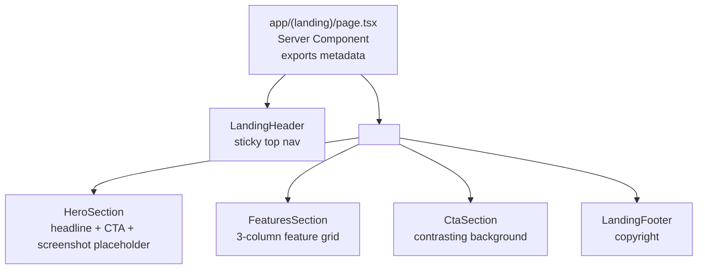
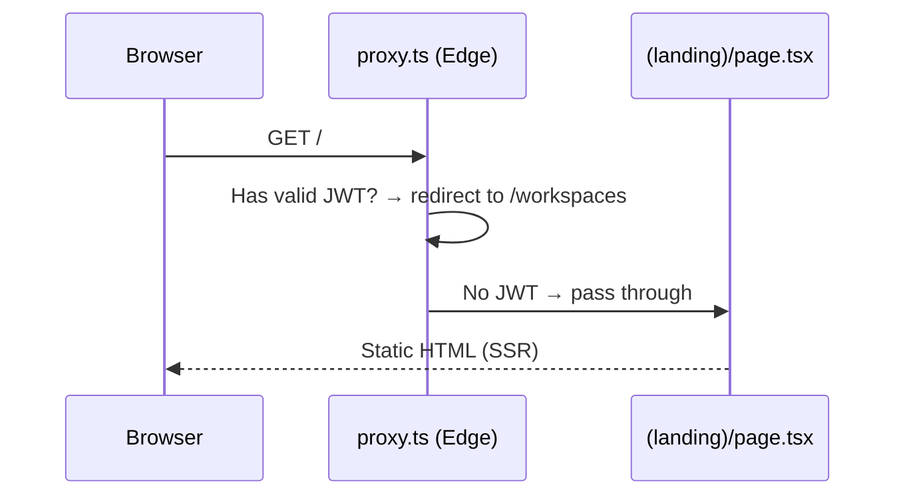

# Design Document: Landing Page

## Overview

The MiniSlack landing page is a static, server-rendered marketing page at `/` within the `(landing)` route group. It communicates the product's value proposition to unauthenticated visitors and funnels them toward `/signin`.

The page is composed of five sections rendered in order: **Header → Hero → Features → CTA → Footer**. It is built entirely with Tailwind CSS v4 utility classes and Radix Colors CSS custom properties — no external component library.

### Key Design Decisions

- **Radix Colors for the palette**: `@radix-ui/colors` provides perceptually-balanced, accessible color scales. Violet 9 is the primary accent (CTA buttons, highlights). Gray scales handle backgrounds and text. This keeps contrast ratios WCAG AA-compliant by construction.
- **Tailwind v4 `@theme inline`**: Color tokens from Radix are mapped into Tailwind's theme via `@theme inline` in `globals.css`, so they are available as utility classes (`bg-violet-9`, `text-gray-12`, etc.) without any config file changes.
- **Server Components only**: The landing page has no client-side interactivity. All components are React Server Components — no `"use client"` directive needed.
- **Component co-location**: Landing page components live in `app/(landing)/components/` to keep them scoped to the route group and avoid polluting a shared `components/` directory with marketing-only code.
- **Screenshot placeholder**: The hero visual is a styled `<div>` placeholder. It uses a subtle gradient and a mock UI skeleton to suggest a product screenshot without requiring a real asset.

---

## Architecture

### Page Composition



### Request Flow

The landing page is a pure Server Component. No data fetching, no auth checks (the proxy in `proxy.ts` already handles redirecting authenticated users away from `/`). The page renders statically.



---

## Components and Interfaces

### File Structure

```
apps/web/app/(landing)/
├── layout.tsx                        # Existing — full-width wrapper (no changes needed)
├── page.tsx                          # Root page — composes all sections, exports metadata
└── components/
    ├── landing-header.tsx            # Sticky top nav with logo + Sign in link
    ├── hero-section.tsx              # Headline, subheadline, CTA, screenshot placeholder
    ├── features-section.tsx          # 3-column feature grid
    ├── cta-section.tsx               # Secondary CTA with contrasting background
    └── landing-footer.tsx            # Copyright footer
```

### Component Interfaces

#### `page.tsx`

```typescript
// Exports Next.js metadata and composes all landing sections.
// No props — this is a route page component.
export const metadata: Metadata = {
  title: "MiniSlack — Team Messaging",
  description: "A fast, focused messaging app for small teams. Real-time channels, workspaces, and file sharing — without the noise.",
};

export default function LandingPage(): JSX.Element
```

#### `LandingHeader`

```typescript
// Sticky top navigation bar.
// No props — content is static.
export function LandingHeader(): JSX.Element
```

Renders:
- `<header>` with `sticky top-0 z-50` and a backdrop blur
- Logo wordmark: "MiniSlack" as a styled `<span>` (or `<Link href="/">`)
- `<nav>` containing a single "Sign in" `<Link href="/signin">`

#### `HeroSection`

```typescript
// Full-width hero with headline, subheadline, CTA button, and screenshot placeholder.
// No props — content is static.
export function HeroSection(): JSX.Element
```

Renders:
- `<section>` with `aria-labelledby="hero-heading"`
- Primary `<h1 id="hero-heading">` — the main headline
- `<p>` subheadline
- `<Link href="/signin">` styled as a primary button (Violet 9 background)
- Screenshot placeholder `<div>` — a styled mock UI skeleton

#### `FeaturesSection`

```typescript
// Three-column feature grid.
// No props — feature data is defined inline as a static array.
export function FeaturesSection(): JSX.Element

// Internal data shape (not exported):
interface Feature {
  icon: React.ReactNode;   // SVG icon element
  name: string;
  description: string;
}
```

Renders:
- `<section>` with `aria-labelledby="features-heading"`
- `<h2 id="features-heading">` section title
- A `<ul>` grid of three `<li>` feature cards, each containing icon + name + description

#### `CtaSection`

```typescript
// Secondary call-to-action with contrasting background.
// No props — content is static.
export function CtaSection(): JSX.Element
```

Renders:
- `<section>` with a Violet 9 background (contrasting with the gray-1 page background)
- `<h2>` headline
- `<Link href="/signin">` styled as a secondary button (white/light on violet)

#### `LandingFooter`

```typescript
// Copyright footer.
// No props — year is computed at render time via new Date().getFullYear().
export function LandingFooter(): JSX.Element
```

Renders:
- `<footer>` with a top border separator
- Copyright notice: `© {year} MiniSlack`

---

## Data Models

The landing page has no dynamic data. All content is static and defined inline within each component. The only "computed" value is the copyright year (`new Date().getFullYear()`), which is evaluated at server render time.

### Feature Items (static)

```typescript
const features: Feature[] = [
  {
    icon: <MessageIcon />,
    name: "Real-time Messaging",
    description: "Instant messages across channels and direct conversations, with zero perceptible lag.",
  },
  {
    icon: <WorkspaceIcon />,
    name: "Workspaces & Channels",
    description: "Organise your team into focused workspaces with public and private channels.",
  },
  {
    icon: <FileIcon />,
    name: "File Sharing",
    description: "Share files directly in conversations — images, documents, and more.",
  },
];
```

---

## Color System

### Radix Colors Integration

Install `@radix-ui/colors` as a dependency:

```bash
npm install @radix-ui/colors -w @mini-slack/web
```

Import the desired scales in `globals.css` and map them into Tailwind's `@theme inline` block. Radix Colors provides both light and dark mode variants.

```css
/* globals.css */
@import "tailwindcss";
@import "@radix-ui/colors/violet.css";
@import "@radix-ui/colors/violet-dark.css";
@import "@radix-ui/colors/gray.css";
@import "@radix-ui/colors/gray-dark.css";
@import "@radix-ui/colors/white-a.css";

@theme inline {
  /* Existing tokens */
  --color-background: var(--background);
  --color-foreground: var(--foreground);
  --font-sans: var(--font-geist-sans);
  --font-mono: var(--font-geist-mono);

  /* Violet accent scale (Radix CSS vars → Tailwind utilities) */
  --color-violet-1:  var(--violet-1);
  --color-violet-2:  var(--violet-2);
  --color-violet-3:  var(--violet-3);
  --color-violet-4:  var(--violet-4);
  --color-violet-5:  var(--violet-5);
  --color-violet-6:  var(--violet-6);
  --color-violet-7:  var(--violet-7);
  --color-violet-8:  var(--violet-8);
  --color-violet-9:  var(--violet-9);   /* Primary CTA — Violet 9 */
  --color-violet-10: var(--violet-10);  /* CTA hover state */
  --color-violet-11: var(--violet-11);  /* Accent text */
  --color-violet-12: var(--violet-12);  /* High-contrast accent text */

  /* Gray neutral scale */
  --color-gray-1:  var(--gray-1);   /* Page background */
  --color-gray-2:  var(--gray-2);   /* Subtle surface (header bg) */
  --color-gray-3:  var(--gray-3);   /* Component backgrounds */
  --color-gray-4:  var(--gray-4);   /* Hover states */
  --color-gray-5:  var(--gray-5);   /* Active states */
  --color-gray-6:  var(--gray-6);   /* Subtle borders */
  --color-gray-7:  var(--gray-7);   /* UI element borders */
  --color-gray-8:  var(--gray-8);   /* Hovered borders */
  --color-gray-9:  var(--gray-9);   /* Solid backgrounds */
  --color-gray-10: var(--gray-10);  /* Hovered solid backgrounds */
  --color-gray-11: var(--gray-11);  /* Secondary text */
  --color-gray-12: var(--gray-12);  /* Primary text (high contrast) */

  /* White alpha for overlays */
  --color-white-a1:  var(--white-a1);
  --color-white-a6:  var(--white-a6);
  --color-white-a12: var(--white-a12);
}
```

### Semantic Color Usage

| Role | Token | Tailwind class |
|------|-------|----------------|
| Page background | Gray 1 | `bg-gray-1` |
| Header background | Gray 2 + backdrop blur | `bg-gray-2/80 backdrop-blur-sm` |
| Card/feature background | Gray 2 | `bg-gray-2` |
| Card border | Gray 6 | `border-gray-6` |
| Primary text | Gray 12 | `text-gray-12` |
| Secondary text | Gray 11 | `text-gray-11` |
| Footer border | Gray 6 | `border-t border-gray-6` |
| Primary CTA background | Violet 9 | `bg-violet-9` |
| Primary CTA hover | Violet 10 | `hover:bg-violet-10` |
| CTA section background | Violet 9 | `bg-violet-9` |
| CTA section text | White | `text-white` |
| Secondary button (on violet) | White/transparent | `bg-white/10 hover:bg-white/20` |
| Accent text / logo | Violet 11 | `text-violet-11` |
| Focus ring | Violet 8 | `focus-visible:ring-violet-8` |

### Dark Mode

Radix Colors ships separate dark-mode CSS files. By importing `violet-dark.css` and `gray-dark.css`, the Radix CSS custom properties automatically switch under `@media (prefers-color-scheme: dark)` — no additional Tailwind dark: variants needed for color tokens. The existing `globals.css` `--background` / `--foreground` pattern is preserved.

---

## Typography Scale

All type uses Geist Sans (`--font-sans`) loaded in the root layout. Sizes follow Tailwind's default scale.

| Element | Classes | Notes |
|---------|---------|-------|
| Logo wordmark | `text-xl font-bold text-gray-12` | Header |
| Hero headline (`<h1>`) | `text-4xl sm:text-5xl lg:text-6xl font-bold tracking-tight text-gray-12` | Above the fold |
| Hero subheadline (`<p>`) | `text-lg sm:text-xl text-gray-11 max-w-2xl` | Supporting copy |
| Section heading (`<h2>`) | `text-2xl sm:text-3xl font-bold text-gray-12` | Features, CTA |
| Feature name | `text-lg font-semibold text-gray-12` | Card title |
| Feature description | `text-sm text-gray-11 leading-relaxed` | Card body |
| CTA headline | `text-2xl sm:text-3xl font-bold text-white` | On violet bg |
| Footer text | `text-sm text-gray-11` | Copyright |
| Button text | `text-sm font-semibold` | CTAs |

---

## Layout and Responsive Behavior

### Page-level Layout

```
<html>
  <body>
    <div class="w-full">          ← (landing)/layout.tsx
      <header sticky />
      <main>
        <section hero />          ← min-h-[calc(100vh-64px)] on desktop
        <section features />
        <section cta />
      </main>
      <footer />
    </div>
  </body>
</html>
```

### Breakpoints (Tailwind defaults)

| Breakpoint | Width | Behavior |
|------------|-------|----------|
| Default (mobile) | < 640px | Single column, stacked layout |
| `sm` | ≥ 640px | Slightly larger type, wider padding |
| `md` | ≥ 768px | Features grid switches to 3 columns |
| `lg` | ≥ 1024px | Hero switches to two-column (text left, screenshot right) |
| `xl` | ≥ 1280px | Max content width capped at `max-w-7xl mx-auto` |

### Section-by-Section Responsive Behavior

**Header**
- Mobile: logo left, "Sign in" link right — same layout at all sizes
- `max-w-7xl mx-auto px-4 sm:px-6 lg:px-8` for content width

**Hero**
- Mobile (< lg): text centered, screenshot placeholder below text, stacked vertically (`flex flex-col items-center text-center`)
- Desktop (≥ lg): two-column split — text left, screenshot placeholder right (`lg:grid lg:grid-cols-2 lg:gap-12 lg:items-center`)

**Features**
- Mobile: single column (`grid grid-cols-1`)
- Tablet+ (≥ md): three columns (`md:grid-cols-3`)
- Cards have equal height via `h-full` on the inner content wrapper

**CTA Section**
- Single column at all sizes, centered text
- Full-width violet background, `py-16 sm:py-24`

**Footer**
- Single row, centered or space-between depending on content
- `max-w-7xl mx-auto px-4 sm:px-6 lg:px-8`

### Screenshot Placeholder

The hero visual is a `<div>` that mimics a product UI screenshot. It is structured as a three-region app shell: a top global search bar, a left sidebar, and a main channel details pane with a header and a message input footer.

```tsx
<div
  aria-hidden="true"
  className="relative w-full aspect-4/3 rounded-xl border border-gray-6 bg-gray-2 overflow-hidden shadow-2xl flex flex-col"
>
  {/* Global search bar — spans full width at the top */}
  <div className="flex items-center gap-2 px-3 h-9 bg-gray-3 border-b border-gray-6 shrink-0">
    <div className="w-3 h-3 rounded-full bg-gray-5" />
    <div className="flex-1 h-2 bg-gray-4 rounded-full max-w-xs" />
    <div className="w-3 h-3 rounded bg-gray-5" />
  </div>

  {/* Body: sidebar + channel pane */}
  <div className="flex flex-1 min-h-0">
    {/* Mock sidebar — workspace nav + channel list */}
    <div className="w-1/4 bg-gray-3 border-r border-gray-6 flex flex-col gap-2 p-2 shrink-0">
      {/* Workspace name */}
      <div className="h-2 bg-gray-5 rounded w-3/4" />
      {/* Channel items */}
      {[...Array(4)].map((_, i) => (
        <div key={i} className="flex items-center gap-1.5">
          <div className="w-2 h-2 rounded-sm bg-gray-4 shrink-0" />
          <div className="h-2 bg-gray-4 rounded" style={{ width: `${50 + i * 10}%` }} />
        </div>
      ))}
    </div>

    {/* Channel details pane */}
    <div className="flex flex-col flex-1 min-w-0">
      {/* Channel header — name, type badge, member count */}
      <div className="flex items-center gap-2 px-3 h-9 border-b border-gray-6 shrink-0">
        <div className="w-2 h-2 rounded-sm bg-gray-5" />
        <div className="h-2 bg-gray-5 rounded w-1/4" />
        <div className="h-2 bg-gray-4 rounded w-8" />
        <div className="ml-auto flex items-center gap-1">
          <div className="w-3 h-3 rounded-full bg-gray-4" />
          <div className="h-2 bg-gray-4 rounded w-4" />
        </div>
      </div>

      {/* Message list */}
      <div className="flex-1 p-3 space-y-3 overflow-hidden">
        {[...Array(4)].map((_, i) => (
          <div key={i} className="flex gap-2 items-start">
            <div className="w-5 h-5 rounded-full bg-gray-4 shrink-0" />
            <div className="flex-1 space-y-1">
              <div className="h-2 bg-gray-5 rounded w-1/4" />
              <div className="h-2 bg-gray-3 rounded w-3/4" />
              {i % 2 === 0 && <div className="h-2 bg-gray-3 rounded w-1/2" />}
            </div>
          </div>
        ))}
      </div>

      {/* Message input footer */}
      <div className="flex items-center gap-2 px-3 py-2 border-t border-gray-6 shrink-0">
        <div className="flex-1 h-6 bg-gray-3 rounded-md border border-gray-6" />
        <div className="w-5 h-5 rounded bg-gray-4" />
      </div>
    </div>
  </div>
</div>
```

The placeholder is `aria-hidden="true"` since it conveys no meaningful information to screen readers.

---

## Accessibility Considerations

### Semantic Structure

```html
<header>                          <!-- LandingHeader -->
  <nav aria-label="Main navigation">
    ...
  </nav>
</header>
<main>
  <section aria-labelledby="hero-heading">
    <h1 id="hero-heading">...</h1>
  </section>
  <section aria-labelledby="features-heading">
    <h2 id="features-heading">...</h2>
    <ul>
      <li>...</li>  <!-- each feature -->
    </ul>
  </section>
  <section aria-labelledby="cta-heading">
    <h2 id="cta-heading">...</h2>
  </section>
</main>
<footer>...</footer>
```

### Icons

SVG icons used in feature cards must have either:
- `aria-hidden="true"` + a visible text label adjacent to them (preferred — the feature name serves as the label), or
- `role="img"` + `aria-label="..."` if used standalone

Since each feature card has a visible name, icons are decorative in context and should use `aria-hidden="true"`.

### Focus Management

All interactive elements (`<Link>`, `<button>`) receive a visible focus ring via:

```
focus-visible:outline-none focus-visible:ring-2 focus-visible:ring-violet-8 focus-visible:ring-offset-2
```

This is applied as a shared utility class on all CTA links/buttons. The `focus-visible` pseudo-class ensures the ring only appears for keyboard navigation, not mouse clicks.

### Color Contrast

Radix Colors is designed to meet WCAG AA contrast requirements within its scale:
- Gray 12 on Gray 1 background: > 15:1 (passes AAA)
- Gray 11 on Gray 1 background: > 7:1 (passes AA for normal text)
- White on Violet 9 background: Radix guarantees ≥ 4.5:1 for step 9 solid colors
- Violet 11 on Gray 1 background: ≥ 4.5:1 (Radix step 11 is designed for text on light backgrounds)

> Full contrast validation requires manual testing with assistive technologies and an accessibility audit tool (e.g., axe, Lighthouse).

### Skip Navigation

A visually hidden "Skip to main content" link is added as the first focusable element in the header, allowing keyboard users to bypass the navigation:

```tsx
<a
  href="#main-content"
  className="sr-only focus-visible:not-sr-only focus-visible:absolute focus-visible:top-4 focus-visible:left-4 ..."
>
  Skip to main content
</a>
```

The `<main>` element receives `id="main-content"`.

---

## Error Handling

The landing page has no dynamic data fetching, no API calls, and no user input. There are no runtime error conditions to handle beyond:

- **Missing font variables**: Geist Sans is loaded in the root layout. If the font fails to load (network issue), the browser falls back to the system sans-serif font. The `font-sans` Tailwind class maps to `--font-geist-sans` with a system font fallback.
- **`new Date().getFullYear()` in footer**: This is a synchronous, infallible call. No error handling needed.

---

## Testing Strategy

### PBT Applicability Assessment

This feature is a static UI rendering page. All acceptance criteria test for the presence of specific elements, CSS classes, link hrefs, and text content. There are no pure functions with large input spaces, no parsers, no serializers, and no business logic algorithms. **Property-based testing is not appropriate for this feature.**

Instead, the testing strategy uses example-based unit/component tests.

### Unit Tests (example-based)

Tests live in `apps/web/tests/landing/` and use Vitest. Since the components are React Server Components, testing uses React's `renderToString` or a lightweight render utility to assert on the HTML output.

**`page.test.tsx`**
- Assert `metadata.title === "MiniSlack — Team Messaging"`
- Assert `metadata.description` is a non-empty string

**`landing-header.test.tsx`**
- Assert a `<header>` element is rendered
- Assert a `<nav>` element is present
- Assert a link with `href="/signin"` and text "Sign in" is present
- Assert the header has `sticky` in its class list

**`hero-section.test.tsx`**
- Assert an `<h1>` element is rendered
- Assert a link with `href="/signin"` is present (CTA button)
- Assert the screenshot placeholder `<div>` is present and `aria-hidden="true"`

**`features-section.test.tsx`**
- Assert a `<ul>` or list container is rendered
- Assert exactly 3 feature items are rendered
- Assert each feature item contains an icon wrapper, a name, and a description
- Assert the grid container has `md:grid-cols-3` in its class list

**`cta-section.test.tsx`**
- Assert an `<h2>` element is rendered
- Assert a link with `href="/signin"` is present
- Assert the section has a violet background class (`bg-violet-9`)

**`landing-footer.test.tsx`**
- Assert a `<footer>` element is rendered
- Assert the rendered text contains the current year (`new Date().getFullYear().toString()`)
- Assert the rendered text contains "MiniSlack"
- Assert the footer has a top border class (`border-t`)

### Accessibility Checks (example-based)

- Assert `<header>`, `<main>`, `<footer>`, `<nav>`, `<section>` elements are present in the full page render
- Assert all `` elements (if any) have non-empty `alt` attributes
- Assert the skip-to-content link is the first focusable element in the DOM
- Assert all CTA links have `focus-visible:ring` classes applied

### Manual / Visual Testing

The following require manual verification or browser-based tooling:
- Responsive layout at 320px, 768px, 1024px, 1440px viewports
- Sticky header behavior on scroll
- Dark mode color rendering
- Keyboard navigation flow (Tab through all interactive elements)
- Screen reader announcement of section headings
- Color contrast audit via Lighthouse or axe DevTools
