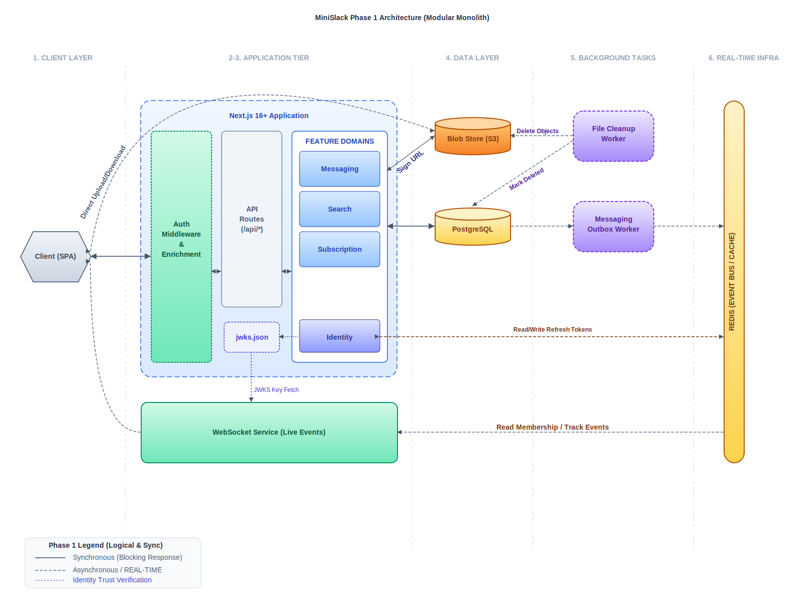

# MiniSlack

A high-performance, real-time messaging platform designed for team collaboration. It provides channels, direct messaging, file sharing, and workspace management with a strong emphasis on **architectural scalability** and **multi-tenant isolation from day one**.

## Table of Contents

- [Design Philosophy](#design-philosophy)
- [Architecture](#architecture)
  - [North Star: 6-Tier Distributed Architecture](#north-star-6-tier-distributed-architecture-long-term-vision)
  - [Phase 1: Modular Monolith](#phase-1-modular-monolith-current)
- [Documentation](#documentation)
- [Getting Started](#getting-started)
- [Project Structure](#project-structure)
- [Tech Stack (Phase 1)](#tech-stack-phase-1)
- [License](#license)

## Design Philosophy

- Start with a modular monolith (Phase 1)
- Monitor for bottlenecks as the system grows
- Decompose services reactively, only when evidence justifies it
- Use a **6-tier distributed architecture** as the North Star vision

## Architecture

### North Star: 6-Tier Distributed Architecture (Long-term Vision)

This is what the system becomes at 10M+ DAU - shows how services, persistence, workers, and real-time infrastructure scale together.


### Phase 1: Modular Monolith (Current)

The foundation (<= 100K DAU) - a single Next.js application with isolated WebSocket service and workers.



**Path Forward**: After Phase 1 launches, metrics are monitored and services decomposed only when bottlenecks emerge. See [Scaling Strategy](./docs/scaling-strategy.md) for how decomposition decisions are made.

For detailed architecture explanation, see [Architecture Overview](./docs/architecture.md).

## Documentation

| Document                                                                          | Purpose                                                                  |
| --------------------------------------------------------------------------------- | ------------------------------------------------------------------------ |
| **[Product Requirements (PRD)](./docs/PRD.md)**                                   | Features, scope, and capacity estimates                                  |
| **[Architecture Overview](./docs/architecture.md)**                               | The 6-tier North Star and design principles                              |
| **[Phase 1: MVP Implementation Plan](./docs/phase-1-mvp/implementation-plan.md)** | How to build the monolith (tech stack, database schema, milestones)      |
| **[Scaling Strategy](./docs/scaling-strategy.md)**                                | Evidence-based evolution: bottleneck patterns and decomposition criteria |

## Getting Started

### 1. Prerequisites

- Node.js (v20+)
- Docker (for database and Redis)

### 2. Setup

```bash
# Install dependencies
npm install

# Start development services (PostgreSQL, Redis)
docker-compose up -d

# Run database migrations
npm run db:migrate -w apps/web

# Start development servers
npm run dev
```

### 3. Environment Variables

Copy `.env.example` to `.env` in the root (or specific packages) and fill in your GitHub OAuth credentials.

## Project Structure

```
mini-slack/
├── docs/                          # Documentation
│   ├── README.md                  # Documentation index
│   ├── architecture.md            # 6-Tier North Star
│   ├── PRD.md                     # Product requirements
│   ├── scaling-strategy.md        # Evidence-based evolution
│   ├── architecture.svg           # Architecture diagram
│   └── phase-1-mvp/
│       ├── implementation-plan.md
│       └── architecture.svg
│
├── apps/
│   └── web/                       # Next.js monolith (Phase 1)
│       ├── app/                   # App Router
│       ├── lib/                   # Domain logic
│       │   ├── identity/          # User & auth
│       │   ├── messaging/         # Channels & messages
│       │   ├── files/             # S3 orchestration
│       │   ├── search/            # Search logic
│       │   └── common/            # Shared DB, logging
│       └── prisma/                # Schema & migrations
│
├── services/
│   └── wss/                       # WebSocket Service (isolated)
│       └── src/
│           ├── index.ts           # JWT verification + stream consumer
│           └── redis/             # Stream consumer logic
│
├── workers/
│   ├── messaging-outbox/          # Publishes events to Redis Streams
│   └── file-cleanup/              # Cleans up orphaned uploads
│
├── packages/                      # Shared code
│   ├── contracts/                 # TypeScript types & DTOs
│   ├── id-gen/                    # Snowflake ID generator
│   ├── logger/                    # Structured logging
│   ├── errors/                    # Error types
│   ├── config/                    # Shared config
│   └── observability/             # OpenTelemetry setup
│
├── infra/                         # Infrastructure & Docker
│   ├── docker-compose.yml         # Local dev services
│   └── postgres/                  # DB init scripts
│
└── package.json                   # Root workspace configuration
```

## Tech Stack (Phase 1)

| Layer            | Technology                                      |
| ---------------- | ----------------------------------------------- |
| **Frontend**     | Next.js 16+ (React 19)                          |
| **Backend API**  | Next.js API Routes                              |
| **Real-time**    | Node.js + `ws` (WebSocket Service)              |
| **Database**     | PostgreSQL + Prisma ORM                         |
| **Cache**        | Redis                                           |
| **Event Bus**    | Redis Streams                                   |
| **Auth**         | JWT (Memory) + Refresh Token (HTTP-only Cookie) |
| **IDs**          | Snowflake IDs                                   |
| **File Storage** | S3-compatible object storage                    |

## License

MIT
