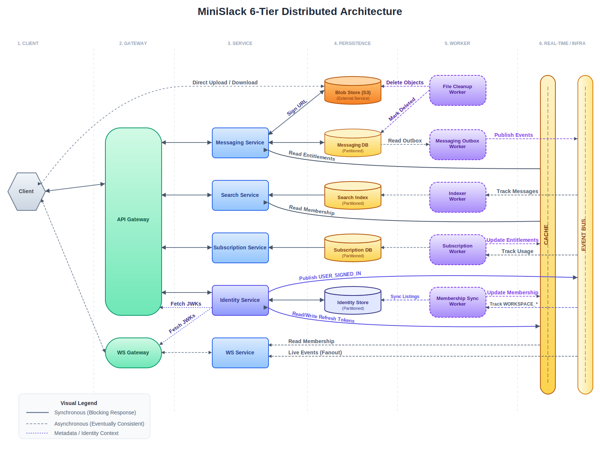
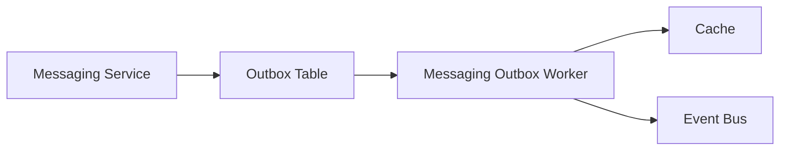
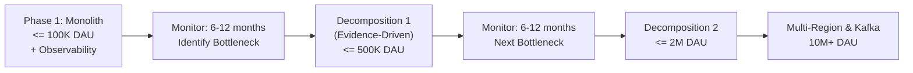

# Architecture Overview - MiniSlack

This document describes the **target-state architecture** for MiniSlack at full scale (10M+ DAU).

> [!NOTE]
> **This is the North Star** - a vision of the system's mature form.
>
> The **actual path to scale is evidence-based, not predetermined**:
>
> 1. Phase 1 launches a modular monolith with strong observability (see [Phase 1 Implementation Plan](./phase-1-mvp/implementation_plan.md))
> 2. As the system grows, we monitor for bottlenecks
> 3. When a bottleneck emerges, we decompose only that service (see [Scaling Strategy](./scaling-strategy.md))
>
> This approach ensures we build only what we need, when we need it.

## Table of Contents

- [1. 6-Tier Distributed Architecture](#1-6-tier-distributed-architecture)
  - [Tier 1: Client Layer](#tier-1-client-layer)
  - [Tier 2: Edge / Gateway Layer](#tier-2-edge--gateway-layer)
  - [Tier 3: Service Layer](#tier-3-service-layer)
  - [Tier 4: Persistence Layer](#tier-4-persistence-layer)
  - [Tier 5: Worker Layer](#tier-5-worker-layer)
  - [Tier 6: Shared Infrastructure (Real-time Backbone)](#tier-6-shared-infrastructure-real-time-backbone)
- [2. Architectural Principles](#2-architectural-principles)
  - [1. Separation of Concerns](#1-separation-of-concerns)
  - [2. Transactional Outbox Pattern](#2-transactional-outbox-pattern)
  - [3. Entitlement-First Design](#3-entitlement-first-design)
  - [4. Fan-out Pattern](#4-fan-out-pattern)
  - [5. Authentication & Security](#5-authentication--security)
  - [6. Profile Denormalization & Sync](#6-profile-denormalization--sync)
  - [6. File Handling & Storage](#6-file-handling--storage)
- [3. Evolution Path](#3-evolution-path)
- [4. Related Documents](#4-related-documents)

## 6-Tier Distributed Architecture

### Tier 1: Client Layer

The entry point for all user interactions.

- **Web Client**: Next.js 16+ Monolith (Landing, App interface, Auth)
- **Mobile Clients**: Future consideration (React Native)

### Tier 2: Edge / Gateway Layer

Handles routing, rate limiting, and authentication.

- **API Gateway**: Routes requests to appropriate services
- **WebSocket Gateway**: Live event broadcasting

### Tier 3: Service Layer

Domain-specific business logic services.

| Service                  | Responsibility                                                               |
| ------------------------ | ---------------------------------------------------------------------------- |
| **Identity Service**     | Authentication, Account Management, global user sharding, session management |
| **Messaging Service**    | Channels, messages, threads, file orchestration                              |
| **Search Service**       | Full-text search, semantic search                                            |
| **Subscription Service** | Plans, seats, entitlements                                                   |

### Tier 4: Persistence Layer

The "heart" of the system - domain-specific data stores.
All tenant data is **partitioned by `workspace_id`** to ensure isolation and enable horizontal sharding.
For distributed consistency, all partitioned entities use **Composite Primary Keys** in the format `(workspace_id, id)`.

| Store               | Purpose                                       | Partitioning Strategy                                    |
| ------------------- | --------------------------------------------- | -------------------------------------------------------- |
| **Identity Store**  | User credentials, sessions (Identity domain)  | **Partitioned by `user_id`** (Hash) + Global Email Index |
| **Messaging DB**    | Channels, messages, outbox (Messaging domain) | **Partitioned by `(workspace_id, channel_id)`**          |
| **Search Index**    | Meilisearch/OpenSearch for full-text indexing | **Partitioned by `(workspace_id, channel_id)`**          |
| **Subscription DB** | Plans, seats, billing (Subscription domain)   | **Partitioned by `workspace_id`**                        |

### Tier 5: Worker Layer

Background processing and async tasks.

| Worker                      | Responsibility                                                               |
| --------------------------- | ---------------------------------------------------------------------------- |
| **Messaging Outbox Worker** | Polls transactional outbox, updates membership cache, publishes to event bus |
| **Indexer Worker**          | Indexes new content for search                                               |
| **File Cleanup Worker**     | Cleans up orphaned uploads and deleted attachments                           |
| **Subscription Worker**     | Tracks usage, updates entitlements                                           |
| **Profile Sync Worker**     | Syncs user profile updates (`USER_UPDATED`) to denormalized memberships      |

### Tier 6: Shared Infrastructure (Real-time Backbone)

Shared infrastructure that spans all domains - the "nervous system" of the architecture.

| Component     | Purpose                                           |
| ------------- | ------------------------------------------------- |
| **Cache**     | High-speed membership, entitlements cache (Redis) |
| **Event Bus** | Async event streaming (Redis Streams → Kafka)     |

These are visualized as vertical "spines" in the architecture diagram, emphasizing their cross-cutting nature.

## Architectural Principles

### 1. Separation of Concerns

Critical domains have independent persistence and logic:

- **Identity**: Who you are
- **Messaging**: What you say
- **Search**: How you find
- **Subscription**: What you can access

### 2. Transactional Outbox Pattern

Guarantees event propagation for high-velocity data (Messages) even if the message bus fails:

- **Guarantee**: At-least-once delivery to the Event Bus.
- **Processing**: Consumers use **Idempotency keys** (Message ID) to achieve effectively **Exactly-once processing**.

### 3. Entitlement-First Design

Real-time permission checks via high-speed cache:

- Membership cached in Redis with TTL
- Permission checks under 1ms
- Cache updates on membership changes

### 4. Fan-out Pattern

WebSocket service subscribes to event partitions:

- Partitioned by channel ID
- No database queries for message delivery
- Horizontal scaling via partition assignment

### 5. Authentication & Security

Hybrid strategy combining performance with Zero Trust principles:

#### Responsibility Breakdown

| Component             | Responsibility               | Checks Performed                                                                                                                                                                                                                                       |
| :-------------------- | :--------------------------- | :----------------------------------------------------------------------------------------------------------------------------------------------------------------------------------------------------------------------------------------------------- |
| **API Gateway**       | **Authentication & Routing** | 1. Validates **JWT** from `Authorization: Bearer` header via public JWKS endpoint 2. Manages **Refresh Tokens** in Redis (opaque, stored in HTTP-only cookies) 3. Enforces tenant-level authorization 4. Routes requests to internal services |
| **Internal Services** | **Business Logic**           | 1. Domain-specific logic (Messaging, Identity) 2. Direct access to DB/Cache                                                                                                                                                                         |
| **Identity Service**  | **Token & Account**          | 1. Signs **Access Tokens** (JWT) and **Refresh Tokens** (opaque, signed) 2. Exposes JWKS at `/.well-known/jwks.json` 3. Account CRUD & Profile management                                                                                        |

#### Token Content Strategy

- **Payload**: Minimal Identity only
- **Permissions**: **NOT** included in token
- **Enforcement**: Services check Cache/DB at runtime

#### Session Management (Token-Based)

1.  **Access Token (JWT)**: Short-lived (15 min), stateless. Contains **Identity only**. Frontend keeps in memory and sends via `Authorization: Bearer` header on each API call.
2.  **Refresh Token**: Long-lived (7 days), opaque and signed. Stored in `HttpOnly` cookies and persisted in Redis (keyed by token hash) with per-user session index for multi-session support and revocation.

**Multi-Session Storage (Redis):**

- Token key: `refresh:<sha256(token)>` → JSON {user_id, session_id, device, created_at, expires_at} with TTL
- Per-user index: `user:refreshs:<user_id>` → ZSET of token hashes (ordered by creation time)
- Enables: session listing, per-device revocation, limit concurrent sessions per user

| Scenario             | Mechanism                                                          | Latency Impact  | Revocable?               |
| :------------------- | :----------------------------------------------------------------- | :-------------- | :----------------------- |
| **Routine API Call** | Frontend sends JWT in header; Gateway validates via JWKS           | None (0ms)      | No (until expiry)        |
| **Token Expired**    | Frontend catches 401, calls `/refresh` with refresh token (cookie) | Low (Redis RTT) | Yes (revoke Redis entry) |
| **Logout/Revoke**    | Delete token from Redis; next refresh fails                        | Immediate       | Yes (immediate)          |

#### Internal Trust

- **API Gateway** verifies the JWT and attaches identity claims (`X-User-ID`, `X-Workspace-ID`) as trusted headers for downstream services.

### 6. Profile Denormalization & Sync

To maintain extreme performance, user profile data (`name`, `avatar`) is denormalized into **Workspace-Partitioned** tables like `WORKSPACE_MEMBER`.

- **Reliability Pattern: Publish-then-Write**: To avoid the overhead of an outbox table for low-frequency updates, the **Identity Service** follows this sequence:
  1.  **Publish**: Sends a `USER_UPDATED(user_id)` pointer-only event (contains no profile data).
  2.  **Write**: Updates the Identity Store.
- **Sync Flow**: Upon receiving the event, the **Profile Sync Worker** (Tier 5) pulls the latest data from the Identity Store.
- **Resiliency**:
  - If **Publish** fails: The update is aborted, ensuring no inconsistency.
  - If **Write** fails: The worker pulls "old" data, resulting in a safe no-op.
- **Latency Trade-off**: This approach favors **read speed** (zero joins) over **write-time consistency**.

### 6. File Handling & Storage

To avoid bottlenecking the application server with file binaries, MiniSlack uses a **Direct-to-Object-Store** pattern.

#### Upload Flow (Direct Upload Pattern)

1.  **Request**: Client requests an upload slot (`POST /api/files/upload-url`) to the **Messaging Service**.
2.  **Creation**: **Messaging Service** creates a `PENDING` file record in the Messaging DB and returns an **S3 Presigned PUT URL**.
3.  **Transfer**: Client uploads binary directly to S3.
4.  **Finalize**: User sends message. The **Messaging Service** persists the message and marks the file as `SENT` in a single **ACID Transaction**.
5.  **Cleanup**: A **File Cleanup Worker** periodically deletes objects from S3 and DB records for: (a) files in `PENDING` state for > 24h, or (b) files with no references in `MessageFile` (orphaned).

#### Delivery Flow

- **Public Assets** (Avatars, Workspace Icons): Served via global CDN.
- **Private Attachments**: Served via **Presigned GET URLs** generated at runtime when messages are loaded. These URLs are short-lived (e.g., 15-60 min) to enforce access control without a dedicated media proxy in Phase 1.

## Evolution Path

**Note**: This document adopts an evidence-based evolution approach; see [Scaling Strategy](./scaling-strategy.md) for details.

| Stage          | Architecture       | Trigger               | Key Changes                                                                     |
| -------------- | ------------------ | --------------------- | ------------------------------------------------------------------------------- |
| **Phase 1**    | Modular Monolith   | Launch                | Next.js app + isolated WSS + workers + observability                            |
| **Monitoring** | Collect metrics    | <= 100K DAU           | Baseline metrics at 25K, 50K, 75K, 100K                                         |
| **Decomp 1**   | Service Extracted  | Bottleneck identified | Extract highest-friction service (usually Messaging or Search)                  |
| **Decomp 2**   | 2-3 Services       | Next bottleneck       | Scale remaining services independently                                          |
| **Scale**      | Distributed System | 2M+ DAU               | Multi-region, Kafka, Kubernetes (see [Scaling Strategy](./scaling-strategy.md)) |

## Related Documents

- [Product Requirements](./PRD.md)
- [Phase 1 Implementation](./phase-1-mvp/implementation_plan.md)
- [Scaling Strategy](./scaling-strategy.md)
