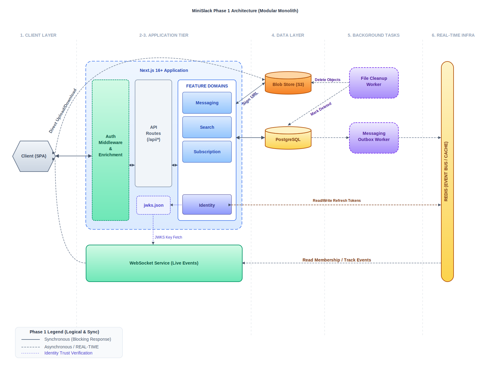

# Phase 1: MVP Implementation Plan

**Target Scale**: <= 100,000 DAU  
**Focus**: Rapid development with strong domain boundaries

## Overview

Phase 1 delivers a fully functional real-time messaging application using a
**Modular Monolith** architecture. All business logic resides in a single
Next.js application, with dedicated workers for the messaging outbox and file cleanup (orphaned uploads/deleted attachments), and an isolated WebSocket service for real-time connections.

The system is designed with **Multi-Tenant Isolation** from day one, logically
partitioning all data by `workspace_id`.



## Table of Contents

- [1. Tech Stack](#1-tech-stack)
- [2. Project Structure](#2-project-structure)
- [3. Database Schema](#3-database-schema)
- [4. Task Breakdown](#4-task-breakdown)
  - [Milestone 1: Foundation](#milestone-1-foundation)
  - [Milestone 2: Database & Domain Logic](#milestone-2-database--domain-logic)
  - [Milestone 3: Auth Slice](#milestone-3-auth-slice)
  - [Milestone 4: Workspace & Channel Slice](#milestone-4-workspace--channel-slice)
  - [Milestone 5: Messaging Slice](#milestone-5-messaging-slice)
  - [Milestone 6: Real-time Slice](#milestone-6-real-time-slice)
  - [Milestone 7: File Sharing Slice](#milestone-7-file-sharing-slice)
  - [Milestone 8: Search Slice](#milestone-8-search-slice)
  - [Milestone 9: Polish & Production Readiness](#milestone-9-polish--production-readiness)
  - [Milestone 10: Observability & Monitoring](#milestone-10-observability--monitoring)
- [5. Verification Plan](#5-verification-plan)
- [6. Related Documents](#6-related-documents)

## Tech Stack

| Layer         | Technology                                                              | Purpose                                            |
| ------------- | ----------------------------------------------------------------------- | -------------------------------------------------- |
| **Framework** | [Next.js 16+](https://nextjs.org/)                                      | Full-stack Monolith (Landing Page + APP UI + RPC)  |
| **RPC**       | [oRPC](https://orpc.unnoq.com/)                                         | Type-safe RPC framework (replaces REST endpoints)  |
| **Styling**   | [TailwindCSS 4](https://tailwindcss.com/)                               | Utility-first CSS                                  |
| **Real-time** | [Node.js](https://nodejs.org/) + [ws](https://github.com/websockets/ws) | Live event broadcasting                            |
| **Database**  | [PostgreSQL](https://www.postgresql.org/)                               | Primary data store                                 |
| **ORM**       | [Drizzle](https://orm.drizzle.team/)                                    | Type-safe Query Builder / ORM                      |
| **DB Driver** | `postgres.js`                                                           | High-performance TCP driver (Standard Node.js)     |
| **Cache**     | [Redis](https://redis.io/)                                              | Session cache, entitlement cache, membership cache |
| **Event Bus** | Redis Streams                                                           | Internal async events                              |
| **Auth**      | JWT (Memory) + Refresh Token (HTTP-only Cookie)                         | Stateful-Stateless Hybrid model                    |
| **IDs**       | Snowflake IDs                                                           | 64-bit distributed monotonic IDs                   |

## Project Structure

```bash
├── apps/
│   └── web/                  # Next.js Monolith (Landing, App, RPC)
│       ├── app/              # App Router
│       │   ├── (landing)/    # / (Landing)
│       │   ├── (auth)/       # /login, /signin, /signup
│       │   ├── (app)/        # /workspaces, /channels (No Server Actions)
│       │   └── api/
│       │       ├── auth/     # Better Auth handler (/api/auth/[...all])
│       │       └── rpc/      # oRPC handler (/api/rpc/[[...route]])
│       ├── components/       # Shared UI components
│       ├── lib/              # Feature-First Core
│       │   ├── identity/     # Service, types, schemas
│       │   ├── messaging/    # Message/Channel logic
│       │   ├── files/        # S3 orchestration
│       │   ├── search/       # Logic for full-text search
│       │   ├── rpc/          # oRPC routers & type-safe client
│       │   └── common/       # DB client, core utils
│       └── proxy.ts          # Auth token verification and rotation logic
├── services/
│   └── wss/                  # Isolated WebSocket Service
│       ├── src/
│       │   ├── index.ts      # Verifies JWT via JWKS
│       │   └── redis/        # Stream consumer
├── workers/
│   ├── messaging-outbox/      # Messaging Outbox Worker
│   └── file-cleanup/          # File Cleanup Worker
├── packages/
│   ├── events/               # Shared event contracts
│   ├── db/                   # Drizzle ORM schema & migrations
│   ├── id-gen/               # Snowflake ID generator
│   └── logger/               # Structured logging
└── infra/
    ├── docker-compose.yml    # Redis, Postgres
    └── postgres/             # Init scripts
```

## Database Schema

### Identity Domain

```sql
CREATE TABLE users (
  id BIGINT PRIMARY KEY,
  name VARCHAR(255),
  email VARCHAR(255) UNIQUE NOT NULL,
  email_verified BOOLEAN DEFAULT FALSE,
  created_at TIMESTAMPTZ NOT NULL DEFAULT NOW(),
  updated_at TIMESTAMPTZ NOT NULL DEFAULT NOW()
);

CREATE UNIQUE INDEX users_email_uidx ON users(email);

CREATE TABLE accounts (
  user_id BIGINT NOT NULL REFERENCES users(id) ON DELETE CASCADE,
  id BIGINT NOT NULL,
  provider_id VARCHAR(50) NOT NULL,
  provider_account_id VARCHAR(255) NOT NULL,
  access_token TEXT,
  refresh_token TEXT,
  access_token_expires_at TIMESTAMPTZ,
  refresh_token_expires_at TIMESTAMPTZ,
  scope TEXT,
  password TEXT,
  created_at TIMESTAMPTZ NOT NULL DEFAULT NOW(),
  updated_at TIMESTAMPTZ NOT NULL DEFAULT NOW(),
  PRIMARY KEY (user_id, id)
);

CREATE UNIQUE INDEX accounts_provider_account_id_uidx ON accounts(provider_id, provider_account_id);

CREATE TABLE sessions (
  user_id BIGINT NOT NULL REFERENCES users(id) ON DELETE CASCADE,
  id BIGINT NOT NULL,
  token VARCHAR(255) NOT NULL,
  expires_at TIMESTAMPTZ NOT NULL,
  user_agent TEXT,
  ip_address VARCHAR(45),
  created_at TIMESTAMPTZ NOT NULL DEFAULT NOW(),
  updated_at TIMESTAMPTZ NOT NULL DEFAULT NOW(),
  PRIMARY KEY (user_id, id)
);

CREATE TABLE verifications (
  id BIGINT PRIMARY KEY,
  identifier VARCHAR(255) NOT NULL,
  value VARCHAR(255) NOT NULL,
  expires_at TIMESTAMPTZ NOT NULL,
  created_at TIMESTAMPTZ NOT NULL DEFAULT NOW(),
  updated_at TIMESTAMPTZ NOT NULL DEFAULT NOW()
);

CREATE TABLE passkeys (
  user_id BIGINT NOT NULL REFERENCES users(id) ON DELETE CASCADE,
  id BIGINT NOT NULL,
  name VARCHAR(255),
  public_key TEXT NOT NULL,
  credential_id TEXT NOT NULL,
  counter BIGINT NOT NULL,
  device_type VARCHAR(50) NOT NULL,
  backed_up BOOLEAN NOT NULL,
  transports TEXT,
  created_at TIMESTAMPTZ NOT NULL DEFAULT NOW(),
  PRIMARY KEY (user_id, id)
);

CREATE TABLE two_factors (
  user_id BIGINT NOT NULL REFERENCES users(id) ON DELETE CASCADE,
  id BIGINT NOT NULL,
  secret TEXT NOT NULL,
  backup_codes TEXT NOT NULL,
  created_at TIMESTAMPTZ NOT NULL DEFAULT NOW(),
  updated_at TIMESTAMPTZ NOT NULL DEFAULT NOW(),
  PRIMARY KEY (user_id, id)
);
```

### Messaging Domain (Workspace Partitioned)

```sql
CREATE TYPE member_role AS ENUM ('owner', 'admin', 'member');
CREATE TYPE channel_type AS ENUM ('public', 'private');
CREATE TYPE invitation_status AS ENUM ('pending', 'accepted', 'rejected', 'expired');
CREATE TYPE file_status AS ENUM ('temporary', 'in_use', 'deleted');

CREATE TABLE workspaces (
  id BIGINT PRIMARY KEY,
  name VARCHAR(255) NOT NULL,
  slug VARCHAR(255) UNIQUE NOT NULL,
  logo_url VARCHAR(512),
  created_at TIMESTAMPTZ NOT NULL DEFAULT NOW(),
  updated_at TIMESTAMPTZ NOT NULL DEFAULT NOW()
);

CREATE UNIQUE INDEX workspaces_slug_uidx ON workspaces(slug);

CREATE TABLE workspace_members (
  workspace_id BIGINT NOT NULL REFERENCES workspaces(id) ON DELETE CASCADE,
  user_id BIGINT NOT NULL,
  role member_role NOT NULL DEFAULT 'member',
  name VARCHAR(255),
  avatar_url VARCHAR(512),
  created_at TIMESTAMPTZ NOT NULL DEFAULT NOW(),
  updated_at TIMESTAMPTZ NOT NULL DEFAULT NOW(),
  PRIMARY KEY (workspace_id, user_id)
);

CREATE INDEX workspace_members_user_id_idx ON workspace_members(user_id);

CREATE TABLE workspace_invitations (
  workspace_id BIGINT NOT NULL REFERENCES workspaces(id) ON DELETE CASCADE,
  id BIGINT NOT NULL,
  email VARCHAR(255) NOT NULL,
  role member_role DEFAULT 'member',
  status invitation_status DEFAULT 'pending',
  expires_at TIMESTAMPTZ NOT NULL,
  inviter_id BIGINT NOT NULL,
  created_at TIMESTAMPTZ NOT NULL DEFAULT NOW(),
  PRIMARY KEY (workspace_id, id)
);

CREATE TABLE channels (
  workspace_id BIGINT NOT NULL REFERENCES workspaces(id) ON DELETE CASCADE,
  id BIGINT NOT NULL,
  name VARCHAR(255) NOT NULL,
  type channel_type NOT NULL DEFAULT 'public',
  created_at TIMESTAMPTZ NOT NULL DEFAULT NOW(),
  updated_at TIMESTAMPTZ NOT NULL DEFAULT NOW(),
  PRIMARY KEY (workspace_id, id)
);

CREATE UNIQUE INDEX channels_name_uidx ON channels(workspace_id, name);

CREATE TABLE channel_members (
  workspace_id BIGINT NOT NULL,
  channel_id BIGINT NOT NULL,
  user_id BIGINT NOT NULL,
  role member_role NOT NULL DEFAULT 'member',
  last_seen_message_id BIGINT,
  created_at TIMESTAMPTZ NOT NULL DEFAULT NOW(),
  updated_at TIMESTAMPTZ NOT NULL DEFAULT NOW(),
  PRIMARY KEY (workspace_id, channel_id, user_id),
  CONSTRAINT channel_fk
    FOREIGN KEY (workspace_id, channel_id)
    REFERENCES channels(workspace_id, id) ON DELETE CASCADE
);

CREATE INDEX channel_members_user_id_idx ON channel_members(workspace_id, user_id);

CREATE TABLE messages (
  workspace_id BIGINT NOT NULL,
  channel_id BIGINT NOT NULL,
  id BIGINT NOT NULL,
  content TEXT NOT NULL,
  author_id BIGINT NOT NULL,
  created_at TIMESTAMPTZ NOT NULL DEFAULT NOW(),
  updated_at TIMESTAMPTZ,
  PRIMARY KEY (workspace_id, channel_id, id),
  CONSTRAINT channel_fk
    FOREIGN KEY (workspace_id, channel_id)
    REFERENCES channels(workspace_id, id) ON DELETE CASCADE
);

CREATE TABLE reactions (
  workspace_id BIGINT NOT NULL,
  channel_id BIGINT NOT NULL,
  id BIGINT NOT NULL,
  message_id BIGINT NOT NULL,
  user_id BIGINT NOT NULL,
  emoji VARCHAR(50) NOT NULL,
  created_at TIMESTAMPTZ NOT NULL DEFAULT NOW(),
  PRIMARY KEY (workspace_id, channel_id, id),
  CONSTRAINT message_fk
    FOREIGN KEY (workspace_id, channel_id, message_id)
    REFERENCES messages(workspace_id, channel_id, id) ON DELETE CASCADE
);

CREATE TABLE files (
  workspace_id BIGINT NOT NULL REFERENCES workspaces(id) ON DELETE CASCADE,
  id BIGINT NOT NULL,
  uploader_id BIGINT,
  url VARCHAR(512) NOT NULL,
  name VARCHAR(255) NOT NULL,
  type VARCHAR(100),
  size BIGINT,
  status file_status DEFAULT 'temporary',
  created_at TIMESTAMPTZ DEFAULT NOW(),
  PRIMARY KEY (workspace_id, id)
);

CREATE TABLE message_files (
  workspace_id BIGINT NOT NULL,
  channel_id BIGINT NOT NULL,
  message_id BIGINT NOT NULL,
  file_id BIGINT NOT NULL,
  created_at TIMESTAMPTZ DEFAULT NOW(),
  PRIMARY KEY (workspace_id, channel_id, message_id, file_id),
  CONSTRAINT file_fk
    FOREIGN KEY (workspace_id, file_id)
    REFERENCES files(workspace_id, id) ON DELETE CASCADE,
  CONSTRAINT message_fk
    FOREIGN KEY (workspace_id, channel_id, message_id)
    REFERENCES messages(workspace_id, channel_id, id) ON DELETE CASCADE
);
```

### Infrastructure

```sql
CREATE TABLE outbox (
  partition_key BIGINT NOT NULL,
  id BIGINT NOT NULL,
  aggregate_type VARCHAR(50) NOT NULL,
  aggregate_id BIGINT NOT NULL,
  event_type VARCHAR(100) NOT NULL,
  payload JSONB NOT NULL,
  created_at TIMESTAMPTZ NOT NULL DEFAULT NOW(),
  published_at TIMESTAMPTZ,
  PRIMARY KEY (partition_key, id)
);

CREATE INDEX outbox_unpublished_idx ON outbox(id) WHERE published_at IS NULL;

CREATE TABLE id_sequences (
  key1 BIGINT NOT NULL,
  key2 BIGINT NOT NULL,
  realm VARCHAR(50) NOT NULL,
  last_timestamp BIGINT NOT NULL,
  sequence BIGINT NOT NULL,
  PRIMARY KEY (key1, key2, realm)
);
```

## Task Breakdown

### Milestone 1: Foundation

- [x] **1.1 Monorepo Setup**
  - Initialize NPM workspaces
  - Configure TypeScript, ESLint, Prettier at root
  - Set up path aliases

- [x] **1.2 Snowflake ID Generator**
  - Implement in `packages/id-gen`
  - Custom epoch (2026-01-01)
  - Machine ID from environment variable
  - Export `generateId()` function

- [x] **1.3 Shared Packages**
  - `packages/db`: Drizzle ORM schema & migrations
  - `packages/events`: Shared event contracts
  - `packages/logger`: Pino-based structured logging
  - `packages/errors`: `AppError`, `NotFoundError`, `ValidationError`
  - Note: Zod schemas live in domain modules (`lib/**/schemas.ts`)

- [x] **2.1 Drizzle & Database Setup**
  - Configure `packages/db`:
    - Define schema using Drizzle DSL in `packages/db/schema/` (using explicit column names for camelCase mapping).
    - Configure Drizzle Kit for migrations in `packages/db/drizzle.config.ts`.
    - Create initial migration.
  - **Client Implementation** in `apps/web`:
    - Install `drizzle-orm` and `postgres.js` driver.
    - Implement `lib/common/db/index.ts` using `drizzle-orm/postgres-js`.
    - Import schema from `packages/db`.
    - Configure for standard Node.js runtime (Vercel default).
      > [!NOTE]
      > **Runtime Choice**: We are using the standard Node.js runtime for the API and Server Components to maintain maximum compatibility with the `postgres.js` driver and high-performance TCP connections.
      >
      > [!CAUTION]
      > **Connection Limits**: With `postgres.js`, avoid connecting directly to your database's primary port (5432) in production. Always use the **Pooled Connection String** (e.g., port 6543) provided by your host. Without this, a spike of 1,000 concurrent users will likely crash your database by exceeding the `max_connections` limit.

#### [NEW] Better Auth Schema Mapping

To ensure Better Auth understands our renamed tables/columns, the following mapping must be configured in the Better Auth initialization (Milestone 2.2):

```typescript
organization({
  schema: {
    organization: {
      modelName: "workspaces",
    },
    member: {
      modelName: "workspace_members",
      fields: {
        organizationId: "workspace_id",
      },
    },
    invitation: {
      modelName: "workspace_invitations",
      fields: {
        organizationId: "workspace_id",
      },
    },
  },
});
```

- [x] **2.2 Infrastructure**
  - Drizzle client initialization and transaction helpers
  - Add outbox table to schema
  - Create `publishEvent()` helper that writes to outbox in same transaction

- [x] **2.3 Feature Logic (Core Services)**
  - `lib/identity`: Auth via Better Auth (Magic Link + GitHub OAuth), session management
  - `lib/messaging`: Workspace, Channel, Message, and Reaction business logic
  - `lib/rpc`: oRPC routers for all procedures (workspaces, channels, messages, members, invitations)

### Milestone 3: Auth Slice

**Goal**: A user can sign in and be redirected to the correct destination.

- [ ] **3.1 App Router Shell**
  - Root layout with font and global styles
  - Route groups: `(landing)`, `(auth)`, `(app)`
  - Auth middleware (`proxy.ts`) for JWT verification and token  ion
  - Redirect logic: new user → `/welcome`, returning user → last active workspace

- [ ] **3.2 Landing Page**
  - `/` — marketing/landing page with sign-in CTA

- [ ] **3.3 Auth Pages**
  - `/signin` — Magic Link + GitHub OAuth sign-in form
  - `/welcome` — post-auth onboarding: create workspace or join by slug

- [ ] **3.4 Auth API**
  - JWKS endpoint (`GET /.well-known/jwks.json`) for WSS JWT verification
  - Cookie management (JWT in memory + Refresh Token as `HttpOnly; SameSite=Lax` cookie)

**Deliverable**: User can sign in via Magic Link or GitHub, land on `/welcome` or their last workspace.

### Milestone 4: Workspace & Channel Slice

**Goal**: A signed-in user can create/join workspaces and browse channels.

- [ ] **4.1 Workspace UI**
  - `/workspaces` — workspace list/picker
  - Create workspace form (name + slug + default channel name)
  - Join workspace by slug
  - Workspace switcher in sidebar

- [ ] **4.2 App Shell**
  - Persistent sidebar layout for `(app)` routes
  - Workspace context: store `active_workspace_id` in `localStorage`, send `X-Workspace-ID` header on all RPC calls
  - Channel list in sidebar (public + joined private channels)

- [ ] **4.3 Channel UI**
  - Create channel modal (name + type)
  - Channel detail view shell (empty message area)
  - Channel settings (rename, delete) for owners/admins

**Deliverable**: User can create a workspace, see channels in the sidebar, and open a channel view.

### Milestone 5: Messaging Slice

**Goal**: Users can send and read messages in channels.

- [ ] **5.1 Message List**
  - Paginated message list with infinite scroll (cursor-based, `before` param)
  - Message bubbles with author name, avatar, and timestamp
  - System messages (e.g., channel renamed)

- [ ] **5.2 Message Input**
  - Rich text input (or plain text with markdown preview)
  - Send via `messages.create` RPC
  - Optimistic UI: message appears immediately, confirmed on response

- [ ] **5.3 Reactions**
  - Emoji reaction picker on hover
  - Reaction counts displayed on messages

- [ ] **5.4 Unread Badges**
  - Unread count per channel in sidebar
  - Mark as read via `channels.members.updateLastSeen` on channel open

**Deliverable**: Users can have a full text conversation in a channel.

### Milestone 6: Real-time Slice

**Goal**: Messages appear instantly for all channel members without a page refresh.

- [ ] **6.1 Messaging Outbox Worker** (`workers/messaging-outbox`)
  - Polling loop (100ms interval)
  - Batch processing (up to 10 events per tick)
  - Publish to Redis Streams
  - Mark events as published

- [ ] **6.2 WebSocket Service** (`services/wss`)
  - JWT authentication via JWKS endpoint
  - Redis Streams consumer (subscribe to channel events)
  - Broadcast to connected clients subscribed to that channel

- [ ] **6.3 Client Integration**
  - WebSocket hook in React (connect on workspace load)
  - Handle `message.created`, `message.updated`, `message.deleted` events
  - Reconnection logic with exponential backoff
  - Replace optimistic message with confirmed server message on receipt

**Deliverable**: Messages, edits, and deletes propagate in real-time to all active channel members.

### Milestone 7: File Sharing Slice

**Goal**: Users can attach files to messages.

- [ ] **7.1 File Service** (`lib/files`)
  - Direct-to-S3 presigned URL generation RPC (`files.getUploadUrl`)
  - Attachment state transition: `temporary` → `in_use` on message send
  - File metadata stored in `files` table; join via `message_files`

- [ ] **7.2 File Cleanup Worker** (`workers/file-cleanup`)
  - Identify orphaned uploads (`temporary` status > 24h)
  - Delete from S3/object storage
  - Mark as `deleted` in DB

- [ ] **7.3 File UI**
  - File attachment button in message input
  - Upload progress indicator
  - Inline image preview in message list
  - Download link for non-image files

**Deliverable**: Users can attach and view images and files in messages.

### Milestone 8: Search Slice

**Goal**: Users can search messages within a workspace.

- [ ] **8.1 Search Service** (`lib/search`)
  - GIN index on `messages.plain_text`
  - `search.messages` RPC procedure (workspace-scoped, paginated)

- [ ] **8.2 Search UI**
  - Search bar in sidebar header
  - Results panel with message excerpts and jump-to-message links

**Deliverable**: Users can search message history within their workspace.

### Milestone 9: Polish & Production Readiness

- [ ] **9.1 Error Handling**
  - Error boundaries for all major UI sections
  - Toast notifications for RPC errors
  - Empty states (no workspaces, no channels, no messages)

- [ ] **9.2 Loading States**
  - Skeleton loaders for message list, channel list, workspace list
  - Suspense boundaries in App Router layouts

- [ ] **9.3 Mobile Layout**
  - Responsive sidebar (collapsible on small screens)
  - Touch-friendly message input and reaction picker

### Milestone 10: Observability & Monitoring

- [ ] **10.1 Structured Logging Setup**
  - Integrate Pino logger across all services (apps/web, services/wss, workers)
  - Log key events: API requests, message publishes, worker iterations
  - Include context: `workspace_id`, `user_id`, `trace_id`, `timestamp`
  - Centralize logs to stdout (Docker/K8s compatible)

- [ ] **10.2 Application Metrics**
  - HTTP endpoint metrics: latency (p50, p95, p99), error rates, request count by RPC procedure
  - Database metrics: query count, query latency, connection pool usage
  - WebSocket metrics: connection count, active subscriptions, message throughput, delivery latency
  - Worker metrics: queue depth, processing time, error rate per worker
  - Blob Store metrics: file upload throughput (MB/s), error rates
  - Install `@opentelemetry/api` and `@opentelemetry/auto` (or instrument manually with Prometheus client)

- [ ] **10.3 Health Checks & Alerts**
  - HTTP endpoint: `GET /api/health` (returns JSON with service status, DB connection, Redis connection)
  - Periodic background check: Alert if outbox publishes are lagging (> 1 second)
  - Database slow query log: Alert on queries > 500ms

- [ ] **10.4 Monitoring Dashboard (Local)**
  - Use Prometheus + Grafana in `docker-compose.yml`
  - Key dashboards:
    - **API Performance**: Request latency, error rate, throughput by RPC procedure
    - **Database Health**: Query latency, connection pool, disk usage
    - **Real-time Health**: Active WebSocket connections, message delivery rate
    - **Worker Health**: Outbox queue depth, file cleanup iterations
  - Export graphs for decision-making (DAU milestones at 25K, 50K, 75K, 100K)

- [ ] **10.5 Business Metrics**
  - Track: DAU, WAU, MAU (from auth logs)
  - Track: Messages/sec, Channels/workspace, File uploads/day
  - Track: P95 message delivery latency
  - Use these to correlate with system bottlenecks

## Verification Plan

### Automated Tests

```bash
# Unit tests
npm run test -w packages/id-gen
npm run test -w packages/events

# Integration tests
npm run test:integration -w apps/web
```

### Manual Verification

- [ ] Login flow sets `jwt` and `refresh_token` cookies
- [ ] Token rotation works via middleware
- [ ] WebSocket server verifies JWT via JWKS
- [ ] Messages appear in real-time for all channel members
- [ ] Mobile layout is usable
- [ ] Observability: Logs are structured and searchable
- [ ] Observability: Dashboards show expected metrics at various load levels

## Related Documents

- [Product Requirements](../PRD.md)
- [Architecture Overview](../architecture.md)
- [Scaling Strategy](../scaling-strategy.md) - Evidence-based evolution from monolith to microservices
